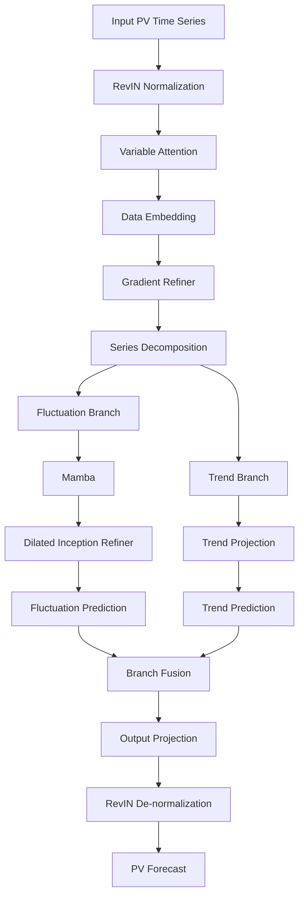

# MDG-Mamba
MDG-Mamba: A Gradient-Enhanced Macro–Micro Decoupled Framework for Photovoltaic Power Forecasting

MDG-Mamba is a lightweight photovoltaic (PV) power forecasting framework built upon the Mamba selective state space model. The framework is designed to improve the modeling of rapidly varying PV power by explicitly enhancing temporal gradients and decoupling long-term trends from high-frequency fluctuations.

## The proposed architecture integrates three main components:

    Variable Attention for adaptive feature weighting;
    Gradient Refiner for explicitly encoding first-order temporal variations;
    Macro–Micro Decoupled Modeling with Mamba and dilated convolutional refinement for separately modeling trend and fluctuation components.

The overall framework is designed to capture both global temporal evolution and fine-grained PV power fluctuations, which are particularly important under rapidly changing generation conditions.

# Overview

Photovoltaic power generation exhibits strong temporal variability caused by changing solar irradiance and weather conditions. Rapid cloud movement can lead to sharp ramp-up and ramp-down events, making accurate multi-step forecasting challenging.

MDG-Mamba addresses these characteristics through a gradient-enhanced and macro–micro decoupled architecture.

````markdown
### The main processing pipeline is:


# Model Configuration

The implementation is compatible with the configuration-based architecture commonly used in long-term time-series forecasting repositories.

## Key Parameters in the Script
## The Mamba block currently uses:
    d_model = configs.d_model
    d_state = 16
    d_conv  = 4
    expand  = 2

## The series decomposition uses:
    kernel_size = 25

# requirements
## The main dependencies include:
    Python 3.10+
    PyTorch
    CUDA
    mamba-ssm
    NumPy
    Pandas
## A typical environment can be prepared with:
    conda create -n mdg-mamba python=3.10
    conda activate mdg-mamba
    
    pip install torch
    pip install numpy pandas
    pip install mamba-ssm

The exact PyTorch, CUDA, and mamba-ssm versions should be selected according to the target GPU and CUDA environment.
